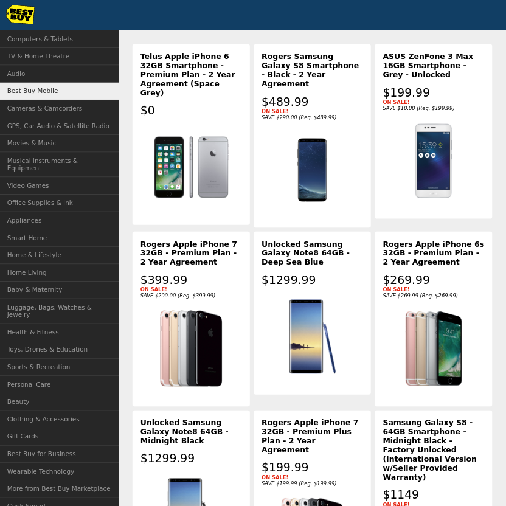

# BBYC - MVC ASSESMENT

The purpose of this exercise is to get an idea of your ability to implement design patterns where
appropriate, with regards to a high-traffic website. In particular we are looking for an object-oriented
approach comprised of extensible, decoupled, and tested modules/components.

The objective is to create a single page web app containing the following:

* Product listings as the main focus (retrieved from Best Buy Canada's REST API)
* Single level category listing side bar
* Modal window for displaying more detailed product information
* Unit tests and functional tests

#### Featured Libraries

* [React](https://facebook.github.io/react/)
* [Webpack](https://webpack.github.io/)
* [Jasmine](https://jasmine.github.io/)
* [Nightwatch](http://nightwatchjs.org/)

#### How To Use

* `npm install` : Install required modules
* `npm start` : Start webpack dev server
* `npm test` : Run unit tests
* `npm run lint` : Lint javascript assets
* `npm run build` : Bundle assets for browser
* `npm run watch` : Watch for file changes and rebuild
